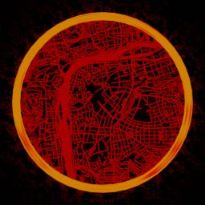

*Co-Authors:* Johanna Spieker, _traum

*Discord:* https://discord.gg/yg7yytYQRq

# Description

You are an architect. The architect of a new civilization. 

You crashlanded on this planet, lost most of your resources, found out it's inhabited by vicious aliens and - yeah - nearly died. But that is merely a small setback on the mission to found your own city. 


# Society

The society you're living in originated from a caste system and is still divided into several groups with vastly differing worldviews. 

- **The Clockwork Caste:** Undemanding, simple and living in boxes. The Clockwork Caste consists mostly of mechanics that keep factories and thus civilisations up and running.
- **The Orchid Caste:** Masters of the flora. The Caste of the farmers, gardeners, botanists. They are also really good cooks.
- **The Gunfire Caste:** The Caste of the military. They do not talk much, but they will make your defenses even deadlier.
- **The Ember Caste:** Historically the Ember Caste was a small group of people that stayed at the campfire and kept the fires alive. In modern times they became the caste of all the people without a caste-forming profession (or due to growing automation: without any profession at all). They are the core of culture, art and social engagement. Everyone likes to have them around.
- **The Foundry Caste:** If you combine the Clockwork and the Gleam Caste, you essentially get the Foundry Caste. They take scientific findings, some nights and lots of caffeine - and create a machine that solves exactly your problem.
- **The Gleam Caste:** Curious and in pursuit of a better understanding of the world - like a spark in the dark. The Gleam People dedicate their lives to expanding their knowledge and sciences. Intellectuals, professors and lifelong students that will greatly improve your research.
- **The Aurora People:** A small group of really famous people. Actors, Artists, Authors, Mod Makers... - people that inspire other people. While they are technically members of the Ember Caste, they are often seen as their own group.
- **The Plasma Caste:** Medical professionals


# Science

While the base game requires you to produce the equipment and funding to research, Sosciencity will add another ingredient: Ideas. 

Each tier of science packs requires you to attract another caste into your city. 

- Automation Science - Clockwork Caste
- Logistic Science - Orchid Caste
- Military Science - Gunfire Caste
- Chemical Science - Ember Caste
- Production Science - Foundry Caste
- Utility Science - Gleam Caste
- Space Science - Aurora People *(not implemented yet)*


# City

As the architect of the city you need to fulfill several responsibilities in order to keep the citizens satisfied. 

- Food
- Clean Water
- Power
- Healthcare
- Safety from Biters
- Garbage Collection


# Bugs

**Please have a look at the Known Problems list before reporting.**

Sosciencity relies heavily on control scripting, which is prone to have bugs that end with desyncs and crashes. Please report any of those, either via github, the mod portal, discord, email, forum PN, or in the forum thread.
If the game gives you an error message, then send that to me. If not or if you think the circumstance of the crash could be hard to replicate, then please send me your savefile. 


# Known Problems

 - Entities like houses or the upbringing station that consume power show up on the "Production" side of the power statistics, despite not actually producing power. Sosciencity simulates their energy usage with hidden EEI entities, which the Factorio engine handles in a weird way. I made a feature request for that.
- You can break Sosciencity's entities by teleporting them (e.g. with Picker Dollies). For example the neighborhood connections or the speed/productivity manipulation will break. Because there is no teleporting of entities in the base game, I didn't implement any teleport detection to save on everyone's UPS.
- If you have another mod installed which adds true speed/productivity modules (meaning modules that provide a bonus without a consumption or pollution malus), you can place them in beacons and have them affect Sosciencity's manufactory/farm type entities. That's not intended, but there's nothing I can do about it. Internally, my mod is placing invisible beacons under those entities as a hacky way to control these stats during control stage. So disallowing these effects isn't an option.
- You can insert Saplings into Mining Drills (and then they'll do nothing).
- The mod doesn't work with multiple player forces. I don't know what will happen, I never played PvP. But not caring about Forces saved myself a lot of headaches.


# Modding the Mod

Sosciencity has a modding API, but it's a work in progress - extensibility is being added piece by piece rather than designed in from the start. Right now other mods can add their own foods, drinking water, housing and buildings and have them participate in Sosciencity's systems as if they were part of the base mod.

If you want to mod Sosciencity and the seam you need isn't exposed yet, please open a feature request describing what you're trying to do. That's the best way to get it added - the API grows based on what modders actually ask for.

### Definition fields

Everything Sosciencity knows about a food, house, drinking water or building is described by a plain Lua definition table. The available fields - and what each one does - are documented by the definitions of the base mod's own content in `constants/`:

- `constants/food.lua` - nutrition, taste, group, healthiness, ...
- `constants/housing.lua` - room count, comfort, caste traits, ...
- `constants/drinking-water.lua` - health and happiness effects
- `constants/buildings.lua` - type, power usage, workforce, range, ...

Read the entries there to learn which fields exist before writing your own definitions. Everything below just feeds tables of this shape into Sosciencity.

### Data stage - creating prototypes

Once Sosciencity's data stage has run, a global `Sosciencity` table is available to any mod that loads after it. Use its helpers instead of assembling prototypes by hand: they build correctly-shaped prototypes for you - handling the food-as-tool conversion, EEI registration for power usage, and the auto-generated tooltips - so your content matches how the base mod creates its own.

```lua
-- in data-stage
Sosciencity.create_food_item({
    name = "arugula",
    icon = "__your-mod__/graphics/arugula.png",
    icon_size = 64,
    subgroup = "sosciencity-food",
    stack_size = 50,
    -- ... normal ItemPrototype fields
}, food_definition)

Sosciencity.configure_building("your-manufactory", {
    type = Type.manufactory,
    power_usage = 50 * Unit.kW,
    range = 20,
    eei = true
})
```

Also available: `make_existing_item_food` (retrofit an existing item into a food item) and `create_house` (item + recipe + entity in one call). See `datastage-api/CLAUDE.md` for the full list and the exact arguments of each helper.

The building example above uses `Unit` and `Type`. These are plain Lua tables you can pull in from Sosciencity so you express quantities the same way the base mod does (`Unit` converts human-readable values like kW to Factorio's per-tick units; `Type` maps building types to their internal IDs):

```lua
local Unit = require("__sosciencity__/constants/unit")
local Type = require("__sosciencity__/enums/type")
```

### Control stage - registering gameplay definitions

The data stage only builds the prototypes; the runtime still needs the definition tables. Register those through the remote interface:

```lua
remote.call("sosciencity", "register_food", "arugula", food_definition)
remote.call("sosciencity", "register_house", "your-apartment", house_definition)
remote.call("sosciencity", "register_drinking_water", "spring-water", water_definition)
remote.call("sosciencity", "register_building", "your-manufactory", building_definition)
```

Each `definition` is a table of the shape documented in the matching `constants/` file above.


# Screenshots


# License

The code in this repository is licensed under the [MIT License](LICENSE).

The mod's art and graphics live in the separate `sosciencity-graphics` mod and are licensed under CC-BY.


# Credits

Thanks to all the nice, helpful people in the Foundry community and in the Factorio discord's mod making channel.
Huge thanks to justarandomgeek, their Factorio Debugger saved me an ocean of headaches.
